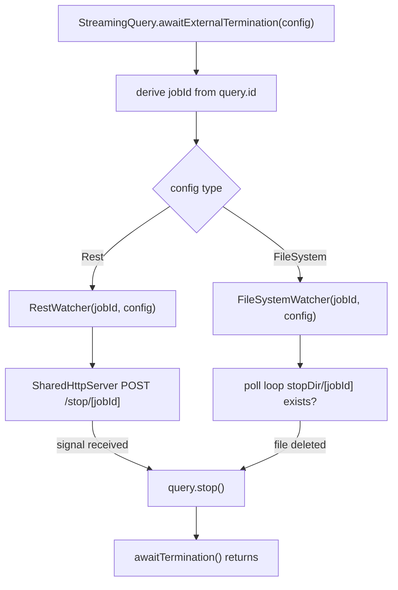
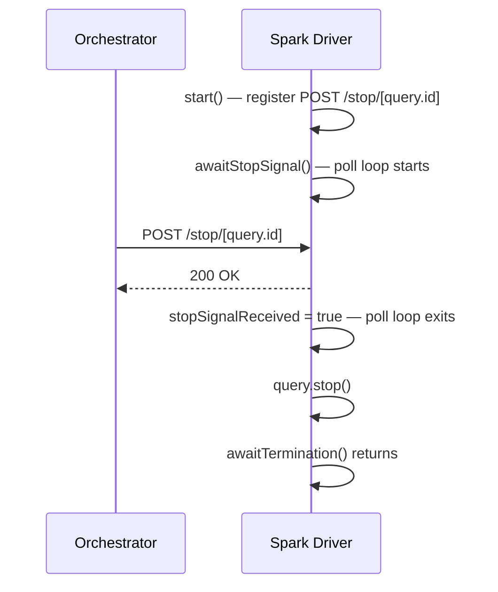
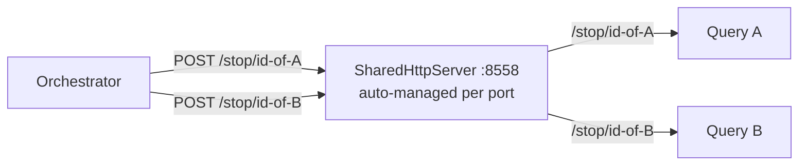
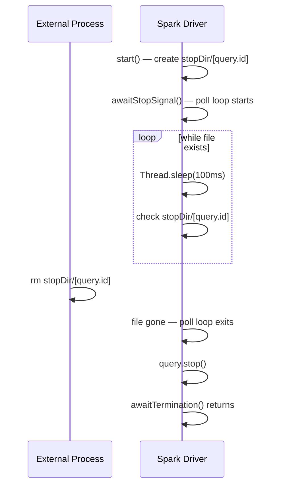

# Stop Streaming Gracefully

A pluggable external termination API for Apache Spark Structured Streaming jobs.  
No direct Spark context access required.

---

## Problem

Spark's `StreamingQuery.stop()` requires direct access to the `SparkSession`, which is unavailable in many managed environments (Databricks notebooks, Azure Synapse, etc.).

This library extends `StreamingQuery` with a single method:

```scala
query.awaitExternalTermination(config: StopConfig)
```

An async watcher (Scala `Future`) monitors a signal source in the background. When a termination signal is received, `stop()` is called automatically — without blocking the streaming thread and without needing a reference to the `SparkSession`.

---

## Architecture



### Supported backends

| Backend          | Signal source                         | Latency | Best for                   |
| ---------------- | ------------------------------------- | ------- | -------------------------- |
| **REST**         | `POST /stop/<jobId>` on the driver    | Low     | Orchestrated pipelines     |
| **FileSystem**   | Marker file deletion (DBFS / local)   | Medium  | Databricks / simple setups |

---

## REST Watcher

The driver starts a lightweight JDK HTTP server. An orchestrator — or any HTTP client — sends a `POST` to stop a specific job.

### REST Watcher — flow



### Multi-job support

Multiple streaming jobs on the same driver can share **the same port**. The library automatically manages a single `HttpServer` per port — no extra configuration needed. Each job gets a unique context path derived from its own `query.id`, so stop signals are always routed to the correct query:



The server starts when the first watcher on that port calls `start()` and is stopped only when the last watcher calls `shutdown()`.

This mirrors the FileSystem backend, where each job has its own marker file (`stopDir/<query.id>`).

### REST Watcher — usage

```scala
import io.github.stopstreaming.extensions.StreamingQueryOps._
import io.github.stopstreaming.extensions.conf.RestStopConfig

val query = spark.readStream. ... .start()

// Default config — binds to all interfaces on port 8558, path /stop
val config = RestStopConfig()

query.awaitExternalTermination(config)
// registered path: POST /stop/<query.id>
```

**Default values:**

| Parameter  | Default     | Description                                      |
| ---------- | ----------- | ------------------------------------------------ |
| `host`     | `"0.0.0.0"` | Binds to all network interfaces                  |
| `port`     | `8558`      | HTTP port                                        |
| `stopPath` | `"/stop"`   | Base path — effective path is `/stop/<query.id>` |

The job identifier is **always derived from `query.id.toString`** inside `awaitExternalTermination`.

Stop from the outside:

```bash
# query.id is a UUID printed in the Spark UI / logs
curl -X POST http://<driver-host>:8558/stop/<query-id>
```

### Multiple jobs on the same driver

```scala
// Same port — each job gets its own path derived from its own query.id
val cfg = RestStopConfig(port = 8558)

queryA.awaitExternalTermination(cfg)   // POST /stop/<id-of-A>
queryB.awaitExternalTermination(cfg)   // POST /stop/<id-of-B>
```

---

## FileSystem Watcher

A background thread polls a directory for the presence of a marker file named after the job. When the file is deleted, the query is stopped.

### FileSystem Watcher — flow



### Supported file systems

| `fsType`                  | Environment                            |
| ------------------------- | -------------------------------------- |
| `FsType.LocalFileSystem`  | Local machine, any Linux/macOS path    |
| `FsType.DBFS`             | Databricks File System (`dbutils.fs`)  |

### FileSystem Watcher — usage

```scala
import io.github.stopstreaming.extensions.StreamingQueryOps._
import io.github.stopstreaming.extensions.conf.{FileSystemStopConfig, FsType}

val query = spark.readStream. ... .start()

// jobName is derived automatically from query.id — no manual passing required
val config = FileSystemStopConfig(
  stopDir = "/tmp/streaming-stop",
  fsType  = FsType.LocalFileSystem
)

query.awaitExternalTermination(config)
// marker file: /tmp/streaming-stop/<query.id>
```

The job identifier is **always derived from `query.id.toString`** inside `awaitExternalTermination`.

Stop from a local shell:

```bash
# query.id is a UUID printed in the Spark UI / logs
rm /tmp/streaming-stop/<query-id>
```

Stop from a Databricks notebook:

```scala
%fs rm /mnt/streaming-stop/<query-id>
```

---

## Loading config from file

Both backends can be configured via HOCON (`src/main/resources/application.conf`):

```hocon
stopstreaming {
  backend = "rest"          # or "filesystem"

  rest {
    host      = "0.0.0.0"
    port      = 8558
    stop-path = "/stop"
  }

  filesystem {
    stop-dir = "/tmp/stopstreaming"
    fs-type  = "LocalFileSystem"    # LocalFileSystem | DBFS
  }
}
```

```scala
import io.github.stopstreaming.extensions.conf.StopConfigLoader
import io.github.stopstreaming.extensions.StreamingQueryOps._

val config = StopConfigLoader.load()          // reads application.conf
query.awaitExternalTermination(config)
```

---

## Requirements

| Dependency       | Version |
| ---------------- | ------- |
| Java             | 17+     |
| Scala            | 2.13    |
| Apache Spark     | 4.1.x   |
| SBT              | 1.9+    |
| Typesafe Config  | 1.4.3   |

The REST backend uses the JDK built-in `HttpServer` and requires the following JVM flag:

```text
--add-exports=jdk.httpserver/com.sun.net.httpserver=ALL-UNNAMED
```

This is already configured in `build.sbt`.

---

## Build

```bash
# Compile
sbt compile

# Run tests
sbt test

# Thin JAR (no dependencies bundled)
sbt package

# Fat JAR — include all dependencies (recommended for deployment)
# Requires sbt-assembly in project/plugins.sbt (see below)
sbt assembly
```

The thin JAR is produced at `target/scala-2.13/stopstreaminggracefully_2.13-0.1.jar`.  
The fat JAR is produced at `target/scala-2.13/stopstreaminggracefully-assembly-0.1.jar`.

To enable fat JAR builds, add to `project/plugins.sbt`:

```scala
addSbtPlugin("com.eed3si9n" % "sbt-assembly" % "2.2.0")
```

---

## Deployment

### Local SBT project

Copy the JAR into your project's `lib/` directory — SBT picks it up automatically as an unmanaged dependency:

```text
your-project/
└── lib/
    └── stopstreaminggracefully_2.13-0.1.jar
```

No `build.sbt` change needed. Rebuild your project with `sbt compile`.

Alternatively, publish to your local Ivy cache and reference it as a managed dependency:

```bash
# in this repo
sbt publishLocal
```

```scala
// your project's build.sbt
libraryDependencies += "io.github.stopstreaming" %% "stopstreaminggracefully" % "0.1"
```

---

### spark-submit (local Spark / YARN / Kubernetes)

Use the **fat JAR** so all transitive dependencies (Typesafe Config, etc.) are included:

```bash
spark-submit \
  --jars /path/to/stopstreaminggracefully-assembly-0.1.jar \
  --conf "spark.driver.extraJavaOptions=--add-exports=jdk.httpserver/com.sun.net.httpserver=ALL-UNNAMED" \
  --class com.example.MyStreamingApp \
  my-app.jar
```

If your application JAR is already a fat JAR that includes this library, `--jars` is not needed.

---

### Databricks cluster

#### Step 1 — upload the JAR

Via the Databricks UI:  
`Compute → <your cluster> → Libraries → Install new → Upload → JAR`  
Upload `stopstreaminggracefully-assembly-0.1.jar`.

Or via `dbutils` in a notebook:

```scala
dbutils.fs.cp(
  "file:///path/to/stopstreaminggracefully-assembly-0.1.jar",
  "dbfs:/FileStore/jars/stopstreaminggracefully-assembly-0.1.jar"
)
```

Then install from DBFS:  
`Compute → <your cluster> → Libraries → Install new → DBFS → dbfs:/FileStore/jars/stopstreaminggracefully-assembly-0.1.jar`

#### Step 2 — add the JVM export flag

In the cluster's Spark configuration (`Advanced options → Spark config`):

```text
spark.driver.extraJavaOptions --add-exports=jdk.httpserver/com.sun.net.httpserver=ALL-UNNAMED
```

#### Step 3 — use in a notebook

```scala
import io.github.stopstreaming.extensions.StreamingQueryOps._
import io.github.stopstreaming.extensions.conf.{FileSystemStopConfig, FsType}

val query = spark.readStream. ... .start()

val config = FileSystemStopConfig(
  stopDir = "dbfs:/tmp/streaming-stop",
  fsType  = FsType.DBFS
)

query.awaitExternalTermination(config)
// marker file: dbfs:/tmp/streaming-stop/<query.id>
// delete it from another cell or notebook to stop the query
```

---

## Project structure

```text
src/main/scala/io/github/stopstreaming/extensions/
├── StreamingQueryOps.scala          extension method on StreamingQuery
├── StopSignalWatcher.scala          common trait for all backends
├── conf/
│   ├── StopConfig.scala             sealed trait + RestStopConfig + FileSystemStopConfig
│   └── StopConfigLoader.scala       loads config from application.conf (HOCON)
├── fs/
│   ├── FileSystemWatcher.scala      polls for marker file deletion
│   ├── FileSystemWrapper.scala      trait
│   ├── LocalFileSystemWrapper.scala local FS implementation
│   └── DbfsWrapper.scala            Databricks FS implementation
└── rest/
    └── RestWatcher.scala            embedded JDK HTTP server
```
